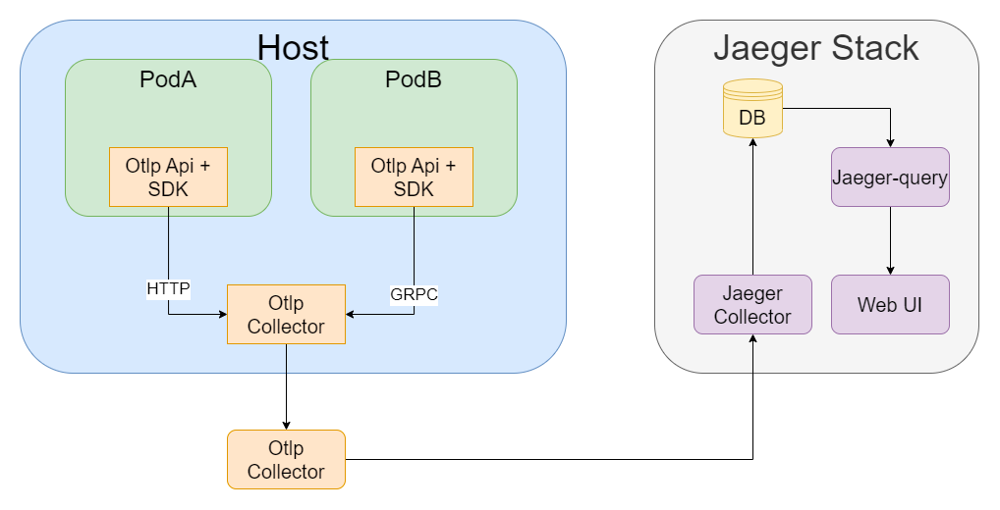
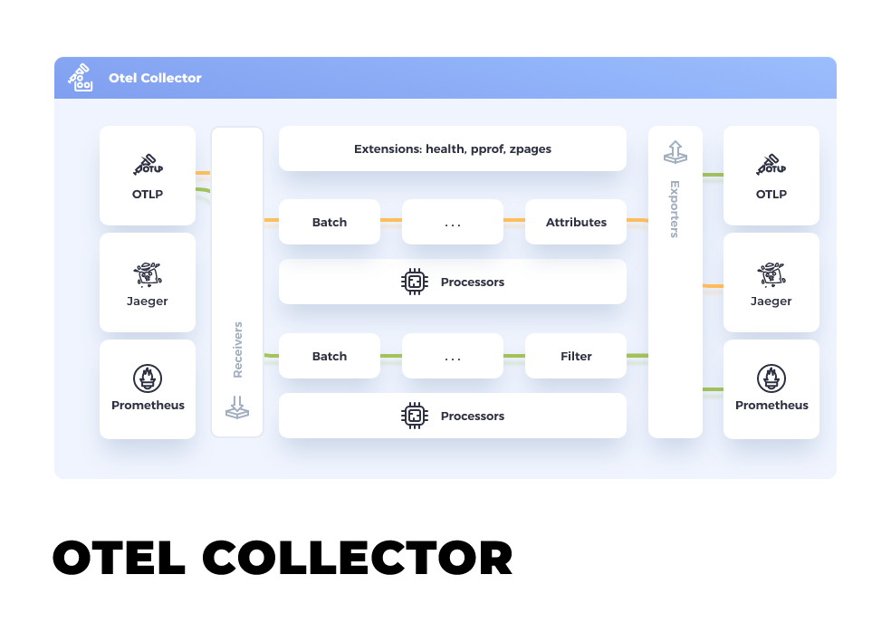

# Opentelemetry+Jaeger链路追踪

## 背景

- 微服务架构中可观测的组件包含日志(log),指标(metric)和链路追踪(tracing)
    - 日志:常见`ELK,EFK,Loki,E:elasticsearch,K:kibana,L:logstash,F:filebeat`;
    - 指标:`Prometheus+Grafana`
    - 链路追踪:`Opentelemetry+Jaeger`

## 专有名词解释

- `Trace`:请求从发起到结束完整的生命周期;
- `Span`:独立逻辑单元,即对重要流程的函数监测;通常,一条Trace由多个Span组成.
- `W3C Trace`:万维网联盟制定的链路追踪的标准,定义追踪信息的格式.
- [Opentelemetry](https://opentelemetry.io/docs/):云原生CNCF旗下项目之一，主打链路追踪及指标功能，包含一系列SDK和API，项目中主要使用他的API和采集器，简称otlp, otel。
- [Jaeger](https://www.jaegertracing.io/):云原生CNCF旗下项目之一，主打链路追踪。也包含SDK和API，项目中主要使用他的UI及后端。发音“杰哥”，“椰哥”。

## 技术栈部署结构



- 微服务中,我们使用了OTLP的API，对代码里面感兴趣的逻辑，或者函数进行埋点。
- 集群的每台宿主机上，都会运行以DaemonSet的方式运行一个OTLP Collector，它的任务是收集运行在此台宿主机上所有负载发送给它的链路信息。
- 在整个集群里，运行一个或者多个Boss OTLP Collector，其职责是对每个宿主机上收集来信息做集中并进一步清洗。并且将链路信息发送给下游Jaeger Collector。
- Jaeger Stack中的数据库可以多种选择，Cassandra\Elastic Search\InMemory。`All In One`镜像使用内存部署.
- 我们采取Jaeger的组件化部署,因为不需要直接推Jaeger,所以仅需要Jaeger-Collector(采集器)和Jaeger-Query(UI&&Service).
- Otlp 和 Jaeger 虽然是不同的项目，但是他们都遵循同一套Trace信息格式W3C。所以他们之间可以无障碍交互。
  
- OpenTelemetry的收集器可以接收来自各种源头的日志，指标，链路追踪信息，进行过滤，清洗，打包等处理，然后输出至下游。

## Jaeger组件

- Collector:采集器
    - port

      |  Port  | Protocol | Function  |
              |----------| ----  | ----  |
      | 9411 | http     | Accepts Zipkin spans in Thrift, JSON and Proto (disabled by default). |
      | 14250 | gRPC     |Used by jaeger-agent to send spans in model.proto format. |
      | 14268 | http     |Accepts spans directly from clients in jaeger.thrift format with binary thrift protocol (POST to /api/traces). Also serves sampling policies at /api/sampling, similar to Agent’s port 5778. |
      | 14269 | http     |Admin port: health check at / and metrics at /metrics. |
      | 4317 | gRPC     |Accepts traces in OpenTelemetry OTLP format if --collector.otlp.enabled=true |
      | 4318  | http     |Accepts traces in OpenTelemetry OTLP format if --collector.otlp.enabled=true. |

## Jaeger存储在ES中的索引管理

### [Jaeger使用ES Rollover存储和管理索引](https://www.jaegertracing.io/docs/1.23/deployment/#elasticsearch-rollover)

滚动索引策略比默认的每日索引更复杂,它需要一个初始化作业来准备存储和两个Cron作业来管理索引.

#### 初始化

- 以下命令用来创建索引别名,索引和索引模板来准备Elasticsearch以进行滚动部署
   ```
   docker run -it --rm --net=host jaegertracing/jaeger-es-rollover:latest init http://localhost:9200
   请注意:如果es有密码,则需要传入user和密码:-e ES_USERNAME=elastic -e ES_PASSWORD=changeme
   ```
- 如需要初始化存档存储,添加 `-e ARCHIVE=true`
- 初始化Jaeger后可以使用`--es.use-aliases=true`

#### 滚动到新的索引

- 下一步是定期执行翻转 API，根据提供的条件将写入别名滚动到新索引。该命令还会向读取别名添加一个新索引，以使新数据可用于搜索。
   ```
   docker run -it --rm --net=host -e CONDITIONS='{"max_age": "2d"}' jaegertracing/jaeger-es-rollover:latest rollover  http://localhost:9200
   请注意:如果es有密码,则需要传入user和密码:-e ES_USERNAME=elastic -e ES_PASSWORD=changeme
   ```
- 如果当前写入索引的年龄超过2天，则命令将别名滚动到新索引。
- 下一步是从读取别名中删除旧索引。这意味着旧数据将无法用于搜索。--es.max-span-age这模仿了默认每日索引部署中使用的标志的行为。此步骤可以是可选的，并且可以在下一步中通过索引清理器简单地删除旧索引。
   ```
   从读取别名中删除超过7天的索引:
   docker run -it --rm --net=host -e UNIT=days -e UNIT_COUNT=7 -e ES_USERNAME=elastic -e ES_PASSWORD=uIA2sOHYQvYfyUUgxr2R jaegertracing/jaeger-es-rollover:latest lookback  http://localhost:9200 
   ```

#### 删除旧数据

- `jaeger-es-index-cleaner`可以使用也用于每日指数的删除历史数据。
   ```
   删除超过 14 天的索引
   docker run -it --rm --net=host -e ROLLOVER=true -e ES_USERNAME=elastic -e ES_PASSWORD=uIA2sOHYQvYfyUUgxr2R jaegertracing/jaeger-es-index-cleaner:latest 14 http://localhost:9200
   ```

### [Elasticsearch ILM支持](https://www.jaegertracing.io/docs/1.23/deployment/#elasticsearch-ilm-support)

#### 创建一个Jaeger的ILM

 - API创建ILM
   ```
   curl -X PUT http://localhost:9200/_ilm/policy/jaeger-ilm-policy \
   -H 'Content-Type: application/json; charset=utf-8' \
   --data-binary @- << EOF
   {
       "policy": {
       "phases": {
       "hot": {
       "min_age": "0ms",
       "actions": {
       "rollover": {
       "max_age": "10d"
       },
       "set_priority": {
       "priority": 100
       }
       }
       },
       "delete": {
       "min_age": "2d",
       "actions": {
       "delete": {}
       }
       }
       }
       }
   } 
   EOF
   备注:Kibana前端UI也可以创建
   ```
   - 使用init开启Jaeger索引管理:ES_USE_ILM=true
    ```
    docker run -it --rm --net=host -e ES_USE_ILM=true -e ES_USERNAME=elastic -e ES_PASSWORD=uIA2sOHYQvYfyUUgxr2R jaegertracing/jaeger-es-rollover:latest init http://localhost:9200
    ```
   
## TODO list
 - [ ] Jaeger-Query使用前登陆:只能后面空了使用openshift+sidecar看看能不能实现

## 参考资料

- [Trace Context](https://www.w3.org/TR/trace-context/)
- [Trace Context In Github](https://github.com/w3c/trace-context/)
- [Traceparent Header Field Values](https://www.w3.org/TR/2021/REC-trace-context-1-20211123/#traceparent-header-field-values)
